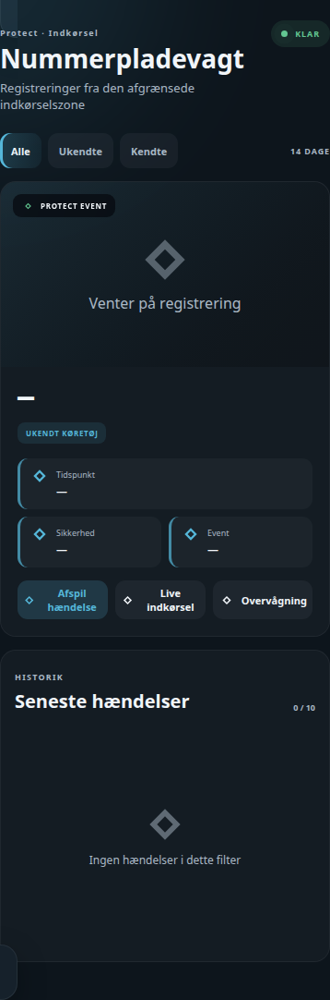

# HA License Plate Card

## Neutral mobile preview



> Rendered at 390 px mobile width with fictional Home Assistant entities and values. No private dashboard, person, address, camera, or sensor data is included.


"Protect Nummerpladevagt" — 14 dages nummerpladehistorik med billeder fra UniFi Protect. Viser seneste registrering stort med billede/afspilning af hændelsen, plus en filtrerbar liste over de sidste 10 hændelser (alle / ukendte / kendte køretøjer).

Kortet er en ren visning oven på en sensor med et `events`-attribut — det kalder ingen UniFi Protect-API direkte, bortset fra Home Assistants indbyggede thumbnail/media-source-endpoints til billeder og videoafspilning.

```yaml
type: custom:ha-license-plate-card
title: Nummerpladevagt
subtitle: Protect · Indkørsel
entity: sensor.protect_nummerpladehistorik
camera_entity: camera.indkorsel_high_resolution_channel
navigation_path: /teknik-overblik/overvagning
```

## Forventet dataformat

`entity` skal være en sensor hvor state er antal aktive hændelser, og `attributes.events` er et array af objekter i denne form:

```json
{
  "event_id": "abc123",
  "plate": "AB12345",
  "known_name": "Familiens bil",
  "confidence": 92,
  "event_time": "2026-09-01T08:15:00+02:00",
  "camera_device_id": "unifi-device-id"
}
```

`known_name` er valgfri — mangler den, vises hændelsen som "ukendt køretøj". Kortet henter selv thumbnails via `/api/unifiprotect/thumbnail/<camera_device_id>/<event_id>` og kan afspille selve hændelsen via Home Assistants `media_source/resolve_media` mod `media-source://unifiprotect/...`.

## Config

| Felt | Type | Standard |
|---|---|---|
| `title` | tekst | "Nummerpladevagt" |
| `subtitle` | tekst | "Protect · Indkørsel" |
| `entity` | entity-id | `sensor.protect_nummerpladehistorik` |
| `camera_entity` | entity-id | `camera.indkorsel_high_resolution_channel` |
| `navigation_path` | tekst | `/teknik-overblik/overvagning` |

`camera_entity` bruges til "Live indkørsel"-knappen (åbner more-info for kameraet). `navigation_path` bruges til "Overvågning"-knappen.

## Installation

1. Kopiér `ha-license-plate-card.js` til `/config/www/ha-license-plate-card/`.
2. Tilføj som Lovelace-resource: `/local/ha-license-plate-card/ha-license-plate-card.js?v=1`, type `module`.
3. Tilføj kortet i en dashboard-view med din egen `entity`.
